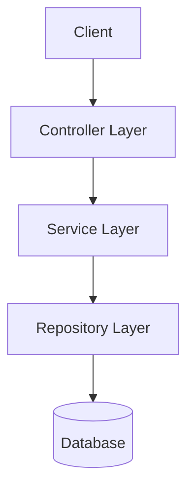

# Architecture

## System Overview

Perfect Repo follows a layered architecture pattern with clear separation of concerns between controllers, services, and repositories.

## Components

| Component      | Responsibility                         |
|---------------|----------------------------------------|
| Controller     | HTTP request handling and routing      |
| Service        | Business logic and orchestration       |
| Repository     | Data access and persistence            |
| Model          | Domain entities and data structures    |

## Architecture Diagram

## Data Flow

1. Client sends an HTTP request
2. Controller validates the request and delegates to the service
3. Service applies business logic and calls the repository
4. Repository interacts with the database and returns data
5. Response flows back through the layers to the client

## Technology Choices

- **Node.js + Express** — lightweight, widely adopted HTTP framework
- **TypeScript** — type safety and better developer experience
- **Layered architecture** — simple, testable, easy to onboard
